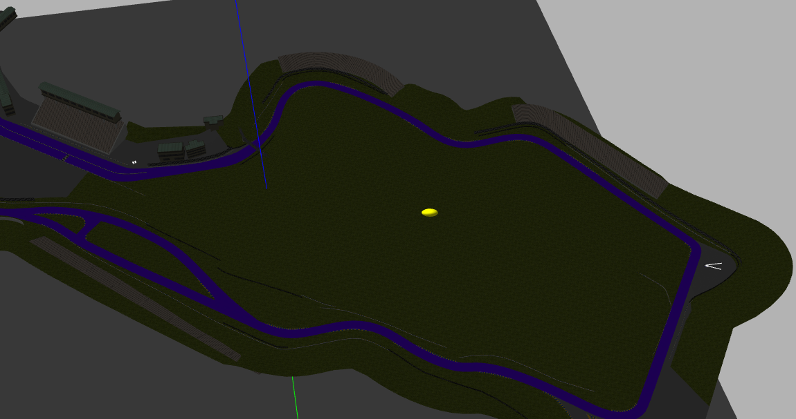

河道仿真环境配置
========

1. 进入`~/.gazebo/models/`目录.
* 将`model.tar.gz`解压到改目录下，解压后它的名字为`sonoma_raceway` .

* 进入`sonoma_raceway`目录，将图片`Track.png`拷贝到`materials/textures`下覆盖之前的`Track.png`.

2. 进入自己的px4 模型目录(我的为`～/px4/Firmware/Tools/sitl_gazebo/models`).
* 将文件`mark_label.tar.gz`解压到该目录下，解压后它的名字为`mark_label`.

3. 在`iris_fpv_cam`模型文件中给无人机添加了下置摄像头.
* 参考本Git中 [gazebo中给无人机添加单目相机](https://zhuanlan.zhihu.com/p/91692124).

4. 启动
```
roslaunch riverdetect mavros_river_sitl.launch
```
整体效果



