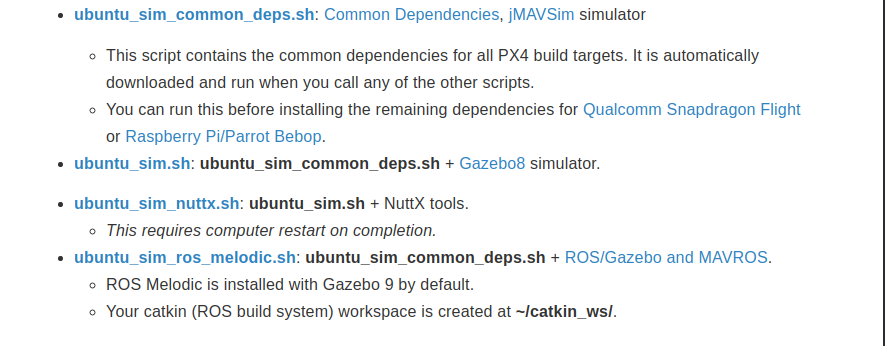

# 如何正确安装ros_px4_gazebo仿真环境

-----
本教程将安装ros, px4工具链, 以及gazebo仿真环境

首先应该了解ubuntu, ros发行版, gazebo版本之间的关系
[参考这里](https://blog.csdn.net/ZhangRelay/article/details/79982187)

所以，给出对应版本的推荐（LTS):

> Ubuntu 14.04 Trusty Tahr     -  ROS Indigo Igloo        -  Gazebo 2.X  2014-2019

> Ubuntu 16.04 Xenial Xerus   -  ROS Kinetic Kame       -  Gazebo 7.X  2016-2021

> Ubuntu 18.04 Bionic Beaver -  ROS Melodic Morenia -  Gazebo 9.X  2018-2023

本教程将在`Ubuntu 16.04`上安装`ROS Kinetic`以及`px4 toolchain`  
**由于`ROS Kinetic`上的gazebo7与`px4 toolchain`中的gazebo9不兼容,所以安装要特别注意**

-----

## 安装px4_toolchain

[PX4 STIL](https://github.com/ukyan/AirSim/blob/master/docs/sitl.md)  

* 安装px4 toolchain

[tool chain](https://dev.px4.io/v1.9.0/en/setup/dev_env_linux_ubuntu.html)


请使用`ubuntu_sim_common_deps.sh`脚本, 该脚本不会安装`gazebo`,不然会将ros-kinetic中安装的gazebo7覆盖

* 编译px4 /Firmware, **这里安装1.8.2版本**

```
mkdir -p PX4
cd PX4
git clone https://github.com/PX4/Firmware.git
cd Firmware

git checkout v1.8.2

git submodule update --init --recursive

make posix_sitl_default

```

## 安装ros

[参考](https://www.cnblogs.com/liu-fa/p/5779206.html)


## 在ros中使用python3[未测试]

```
pip3 install catkin-tools
pip3 install rospkg
sudo apt-get install python3-rosinstall
```
