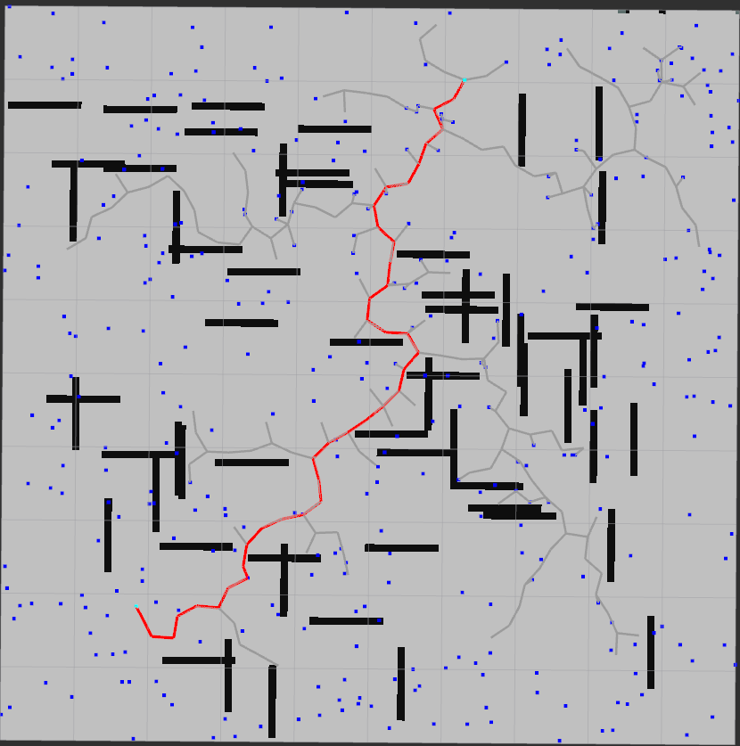
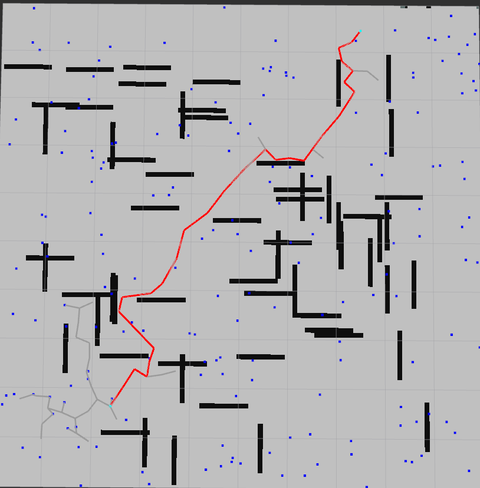
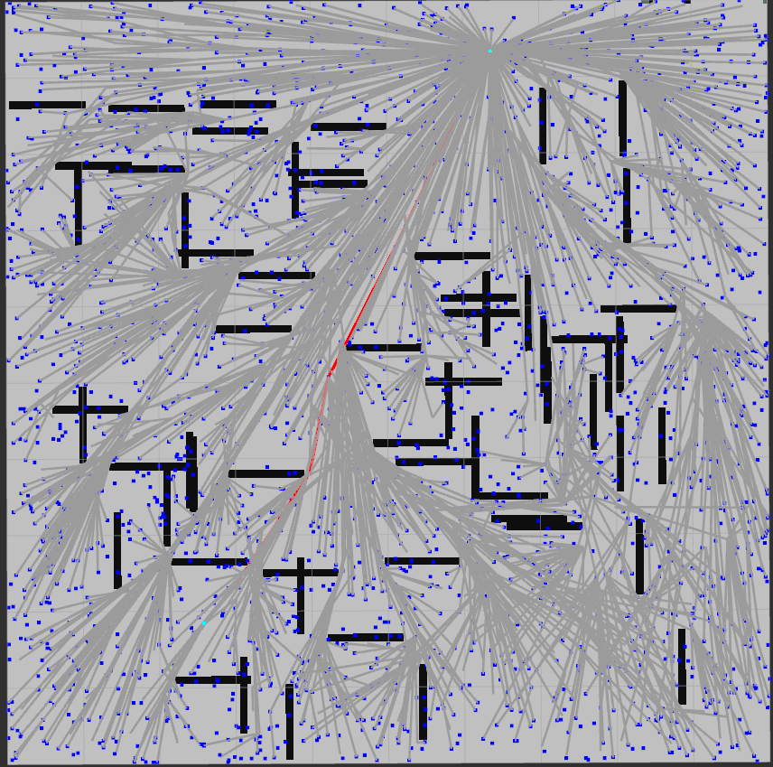

# 这里是路径规划算法

----

## 前端路径搜索

### TODO List


基于搜索的算法
- [x] Dijkstra
- [x] A*
- [x] JPS
- [ ] Hybrid A*


基于采样的算法
- [x] rrt  
- [x] rrt-connet  s
- [x] rrt-star  
- [ ] Kinodynamic rrt-star  


### 基于采样的前端路径搜索算法

- rrt 

[详细的解析](https://zest-pullover-05b.notion.site/RRT-ae20b8ef201a48d4b9ca45387d15f6df)



- rrt-connet



- rrt-star


---

### 如何使用

算法是使用rviz中的 `Publish Point`来选择起始点的， 根据ternimal中的提示，第一个点是起点，第二个点是终点，点第三个点算法运行

- rrt算法测试
```sh
roslaunch navi_algorithm 2d_map_rrt.launch
```

参数可以在 `2d_map_rrt.launch` 中修改


- 图搜索算法测试

```
roslaunch navi_algorithm 2d_map_graph_search.launch
```


## 后端轨迹优化

### TODO List

- [ ] 多项式轨迹表征  

- [ ] 贝塞尔曲线轨迹表征  

- [ ] B样条轨迹表征

- [ ] minimum-snap轨迹优化

- [ ] minimum-jerk轨迹优化


---

## 轨迹跟踪

### TODO List

- [ ] 纯轨迹跟踪
- [ ] 基于MPC的轨迹跟踪